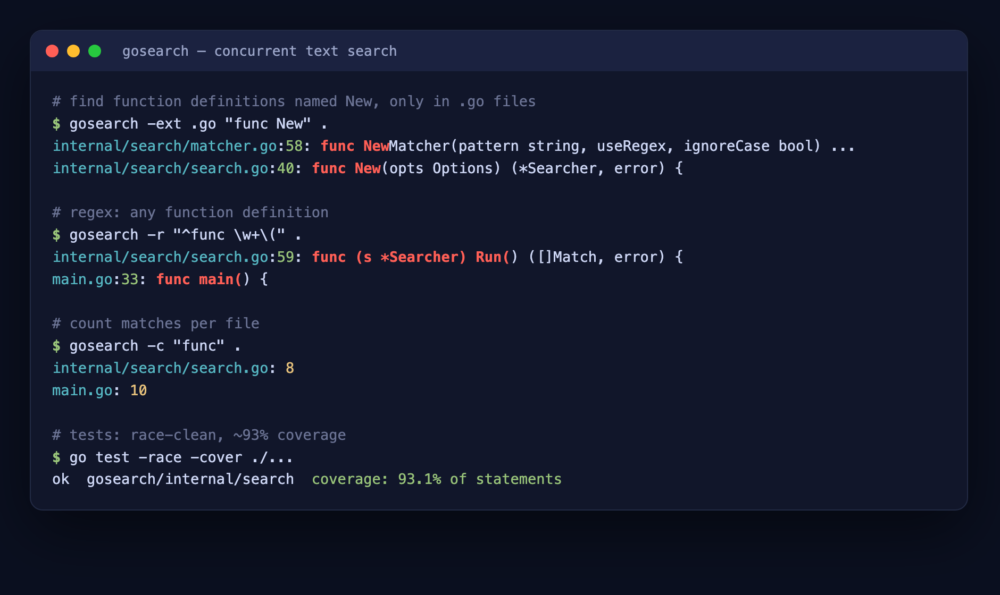

> 🌐 **Language / زبان:** English (this file) · [فارسی](README.fa.md)

# 🐹 Go — From Beginner to Pro


A complete, self-paced **20-session Go course** (English + Persian) **plus two
production-style portfolio projects** you can run, show in interviews, and put on
your CV. Everything here is written from scratch, fully tested, and uses Go 1.25.

---

## 📑 Table of contents

- [What's inside](#-whats-inside)
- [Repository structure](#-repository-structure)
- [Quick start](#-quick-start)
- [The 20-session course](#-the-20-session-course)
- [Portfolio project 1 — TaskFlow (REST API)](#-portfolio-project-1--taskflow-rest-api)
- [Portfolio project 2 — gosearch (CLI)](#-portfolio-project-2--gosearch-cli)
- [Concepts covered](#-concepts-covered)
- [Progress tracker](#-progress-tracker)

---

## 📦 What's inside

| Folder | What it is |
|--------|-----------|
| [`sessions/`](sessions/) | 20 lesson files (each ~1 hour), in **English and Persian** |
| [`examples/`](examples/) | Runnable example code for Sessions 1–17 — one folder per concept |
| [`taskflow/`](taskflow/) | **Portfolio project 1:** a JWT-authenticated REST API (server) |
| [`gosearch/`](gosearch/) | **Portfolio project 2:** a concurrent CLI text-search tool |

Three Go modules live here: `golearn` (the examples), `taskflow`, and `gosearch`.

---

## 🗂️ Repository structure

```
.
├── README.md / README.fa.md      this file (English / Persian)
├── sessions/                     session-01..20 .md  (+ .fa.md Persian)
├── examples/                     runnable code for sessions 1–17
│   ├── session01 … session17
│   └── (each concept in its own runnable folder)
│
├── taskflow/                     ── REST API portfolio project ──
│   ├── main.go                   entry point, graceful shutdown
│   ├── internal/
│   │   ├── api/                  server, routes, middleware, handlers, tests
│   │   ├── auth/                 JWT + bcrypt password hashing
│   │   ├── config/              env-based configuration
│   │   ├── models/              Task, User domain types
│   │   └── store/               SQLite repositories (user-scoped)
│   ├── Dockerfile, Makefile, demo.sh
│   ├── GETTING_STARTED.md        step-by-step run guide (with screenshots)
│   └── RESUME.md                 CV bullets + interview talking points
│
└── gosearch/                     ── CLI portfolio project ──
    ├── main.go                   flag parsing, colored output
    ├── internal/search/          Matcher interface + concurrent worker pool
    ├── Makefile, demo.sh
    └── README.md
```

---

## 🚀 Quick start

**Learn:** open [`sessions/session-01.md`](sessions/session-01.md) and run the examples:

```bash
go run examples/session01/hello/hello.go
```

**Run the REST API:**

```bash
cd taskflow && go run .
# then: curl localhost:8080/health
```

**Run the CLI tool:**

```bash
cd gosearch && go run . -i -ext .go "func" .
```

The commands you'll use constantly:

```bash
go run .            # compile + run
go build ./...      # compile everything
go test ./...       # run all tests
go test -race ./... # check concurrent code for data races
go fmt ./...        # auto-format (always)
```

---

## 📚 The 20-session course

Each session is a full lesson with explanations, runnable examples, and exercises.
Available in **English** (`session-NN.md`) and **Persian** (`session-NN.fa.md`).

### Part 1 — Foundations
| # | Session | What you'll learn |
|---|---------|-------------------|
| 01 | [Hello, Go](sessions/session-01.md) | first program, `go run`/`go build`, packages, `gofmt` |
| 02 | [Variables & Types](sessions/session-02.md) | `var`, `:=`, constants, zero values, type conversion |
| 03 | [Control Flow](sessions/session-03.md) | `if`, `switch`, `iota`, operators |
| 04 | [Loops & Functions](sessions/session-04.md) | the `for` loop, defining/calling functions |
| 05 | [Functions Deep Dive](sessions/session-05.md) | multiple returns, variadic, closures, `defer` |

### Part 2 — Data Structures
| # | Session | What you'll learn |
|---|---------|-------------------|
| 06 | [Arrays & Slices](sessions/session-06.md) | `append`, `make`, slicing, `copy`, the shared-memory gotcha |
| 07 | [Maps, Strings & Runes](sessions/session-07.md) | maps, UTF-8, `rune` vs `byte` |
| 08 | [Structs & Methods](sessions/session-08.md) | custom types, value vs. pointer receivers, embedding |
| 09 | [Pointers](sessions/session-09.md) | `&` and `*`, when and why to use them |

### Part 3 — The Go Way
| # | Session | What you'll learn |
|---|---------|-------------------|
| 10 | [Interfaces](sessions/session-10.md) | implicit interfaces, polymorphism, `any` |
| 11 | [Errors](sessions/session-11.md) | idiomatic errors, `errors.Is/As`, `panic`/`recover` |
| 12 | [Concurrency I](sessions/session-12.md) | goroutines, channels, the `go` keyword |
| 13 | [Concurrency II](sessions/session-13.md) | `select`, `WaitGroup`, `Mutex`, `context`, worker pools |

### Part 4 — Real-World Go
| # | Session | What you'll learn |
|---|---------|-------------------|
| 14 | [Standard Library Tour](sessions/session-14.md) | `strconv`, `time`, `sort`, `os` |
| 15 | [Files, JSON & Encoding](sessions/session-15.md) | file I/O, `encoding/json`, struct tags |
| 16 | [Testing](sessions/session-16.md) | table-driven tests, benchmarks, coverage |
| 17 | [HTTP Servers](sessions/session-17.md) | `net/http`, handlers, routing, JSON APIs |

### Part 5 — The Portfolio Project
| # | Session | What you'll learn |
|---|---------|-------------------|
| 18 | [REST API + Database](sessions/session-18.md) | project layout, SQLite, CRUD endpoints |
| 19 | [Auth, Middleware & Config](sessions/session-19.md) | JWT auth, middleware, env config |
| 20 | [Polish & Ship](sessions/session-20.md) | Docker, graceful shutdown, CV bullets |

---

## 🏆 Portfolio project 1 — TaskFlow (REST API)

A production-style, multi-user **task-management REST API**: each user registers,
logs in, and manages their own private, prioritized task list. Built on Go's
standard library — no web framework.


**Features**
- 🔐 **JWT authentication** with bcrypt-hashed passwords
- 👥 **Per-user data isolation** enforced at the SQL layer (`WHERE user_id = ?`)
- 🧩 **Middleware**: structured logging, panic recovery, auth
- 🏷️ **Task priority** (low/medium/high) + composable filters (`?done=`, `?priority=`)
- 🗄️ **SQLite** via a pure-Go driver (no cgo) — clean handler → repository layers
- 🧪 **Integration tests** with `httptest`; ✅ 🐳 **Dockerized** to a ~21 MB distroless image
- 🛑 **Graceful shutdown** on SIGINT/SIGTERM

**Run it**
```bash
cd taskflow
go run .            # http://localhost:8080
make demo           # runs every endpoint and shows status + timing
go test ./...       # all tests
```

**API**

| Method | Path | Auth | Purpose |
|--------|------|------|---------|
| GET | `/` · `/health` | – | API index / liveness |
| POST | `/auth/register` · `/auth/login` | – | get a JWT |
| GET | `/tasks` (`?done=`, `?priority=`) | ✅ | list/filter your tasks |
| POST | `/tasks` | ✅ | create a task |
| GET·PUT·DELETE | `/tasks/{id}` | ✅ | read / update / delete |

📖 Full walkthrough: [taskflow/GETTING_STARTED.md](taskflow/GETTING_STARTED.md) ·
🧑‍💼 CV bullets: [taskflow/RESUME.md](taskflow/RESUME.md)

---

## 🔎 Portfolio project 2 — gosearch (CLI)

A fast, **concurrent** command-line text search — a mini `grep`/`ripgrep`. It
recursively scans a directory using a **worker pool**, matching plain text or
regular expressions. Standard library only, zero dependencies.



**Features**
- 🔁 Concurrent directory walk + file scanning (a goroutine worker pool, one per CPU)
- 🔤 Literal (fast path) or full **regex** (`-r`) matching, behind a `Matcher` interface
- 🔡 Case-insensitive (`-i`), extension filter (`-ext`), hidden-file control, count mode (`-c`)
- 🎨 Colored output with matches highlighted (auto-off when piped)
- 🧪 Table-driven + temp-dir tests, **race-clean, ~93% coverage**

**Run it**
```bash
cd gosearch
go run . func .                     # find "func" under the current dir
go run . -i -ext .go "todo" .       # case-insensitive, only .go files
go run . -r "^func \w+\(" .         # regex
go test -race -cover ./...          # tests
```

---

## 🧠 Concepts covered

Across the course and projects, this repo demonstrates:

**Language** — variables, types, control flow, functions, closures, `defer` ·
slices, maps, strings/runes · structs, methods, pointers, embedding ·
interfaces & polymorphism · idiomatic error handling.

**Concurrency** — goroutines, channels, `select`, `sync.WaitGroup`, `Mutex`,
`context`, worker pools, and the race detector.

**Real-world** — the standard library, file I/O, JSON, testing (unit,
table-driven, integration, benchmarks, coverage), and HTTP servers.

**Production** — JWT auth, password hashing, middleware, layered architecture,
configuration, SQLite, Docker (multi-stage, distroless), and graceful shutdown.

---

## ✅ Progress tracker

- [x] **Sessions 01–20** — all lessons complete (English + Persian)
- [x] **TaskFlow** — REST API built, tested, Dockerized
- [x] **gosearch** — concurrent CLI built, tested, race-clean

<details>
<summary>Per-session checklist</summary>

- [x] 01 Hello, Go · [x] 02 Variables & Types · [x] 03 Control Flow
- [x] 04 Loops & Functions · [x] 05 Functions Deep Dive
- [x] 06 Arrays & Slices · [x] 07 Maps, Strings & Runes
- [x] 08 Structs & Methods · [x] 09 Pointers
- [x] 10 Interfaces · [x] 11 Errors · [x] 12 Concurrency I · [x] 13 Concurrency II
- [x] 14 Standard Library · [x] 15 Files & JSON · [x] 16 Testing · [x] 17 HTTP Servers
- [x] 18 REST API + DB · [x] 19 Auth & Middleware · [x] 20 Polish & Ship

</details>

---

*Built with Go 1.25. Start learning at [Session 01](sessions/session-01.md), or
jump into [TaskFlow](taskflow/) and [gosearch](gosearch/). Happy coding! 🚀*
